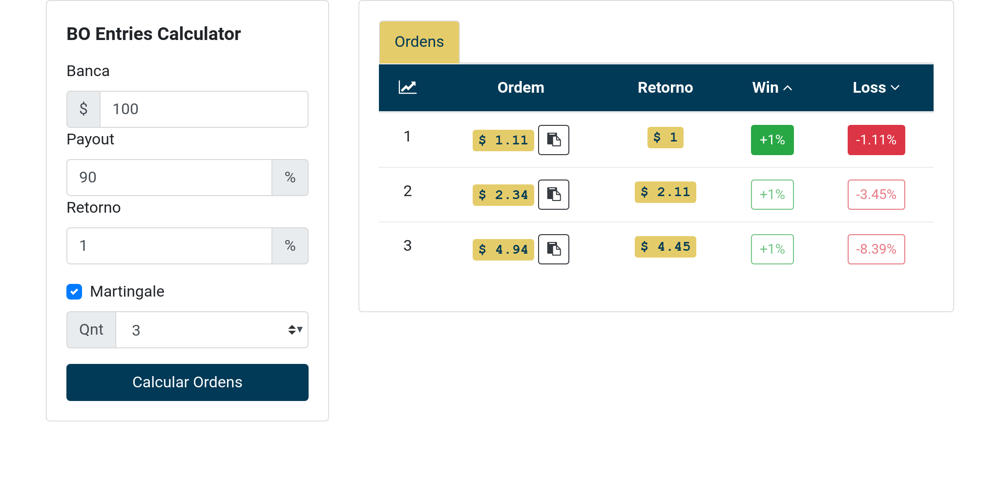
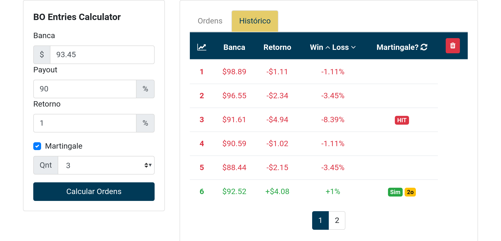

# bo-entries-calculator
## Binary options entries calculator (with martingale)

Done with VueJS and Bootstrap 3

### Screenshots



### Running
``` bash
# install dependencies and start the server
# will open an browser tab on localhost:8080
npm install && npm run dev
```

Thanks for all the :fish:
